Self-taught builder. Two things live here: **[Ruthless Controller Relay](https://github.com/spongebobmoviept-lab/RuthlessControllerRelay)**, which turns a gamepad into a HOTAS for flight sims, and a **[family of self-hosted apps for Plex](#plex-apps)**.

  <a href="https://github.com/spongebobmoviept-lab/RuthlessControllerRelay"></a>

  

  
  
  
  
  

Flight sims and other HOTAS games bind their controls to a joystick, and Windows treats a gamepad as a different kind of device, so those games won't take a controller's sticks. Ruthless Controller Relay shows your controller to them as a virtual joystick, and to everything else as a normal gamepad. Flight-sim and WARDOGS players use it to fly with the controller they already own.

  <a href="https://github.com/spongebobmoviept-lab/RuthlessControllerRelay#how-it-works">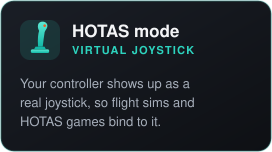</a>
  <a href="https://github.com/spongebobmoviept-lab/RuthlessControllerRelay#how-it-works">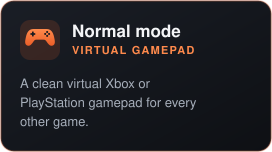</a>
  <a href="https://github.com/spongebobmoviept-lab/RuthlessControllerRelay#controls">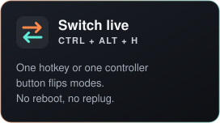</a>

  Rumble, lightbar color and battery level come through wherever the connection allows. 
  <a href="https://github.com/spongebobmoviept-lab/RuthlessControllerRelay#quick-start">Quick start</a> ·
  <a href="https://github.com/spongebobmoviept-lab/RuthlessControllerRelay#what-works-and-what-doesnt">What works on which controller</a> ·
  <a href="https://github.com/spongebobmoviept-lab/RuthlessControllerRelay#is-this-safe-to-run">Is it safe to run?</a> ·
  <a href="https://github.com/spongebobmoviept-lab/RuthlessControllerRelay/blob/main/docs/DEVELOPMENT_JOURNEY.md">How it was built</a> ·
  <a href="https://github.com/spongebobmoviept-lab/RuthlessControllerRelay">Source code</a>

See it running: the live dashboard

 

  

The live dashboard: real-time axis and button state, the current mode, and what the game sees next to what is actually plugged in.

 
 

  <a href="#plex-apps">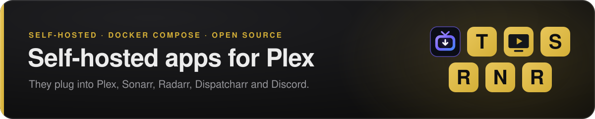</a>

Seven small apps. Each one installs with Docker Compose (amd64 and arm64) and has its own web setup page.

 

<a href="https://github.com/spongebobmoviept-lab/tubarr">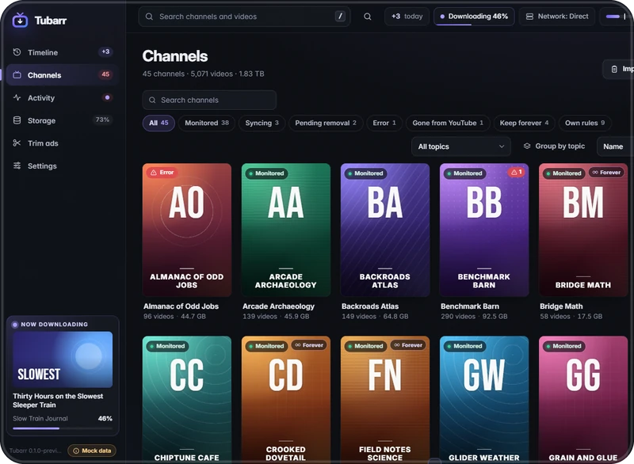</a>

### [Tubarr](https://github.com/spongebobmoviept-lab/tubarr)

**Your YouTube subscriptions, as a Plex library.**

- Channels become shows and playlists become seasons, with the creator's own titles, chapters and subtitles.
- New uploads land in Plex first; the backlog fills in at a calm, human pace.
- Fills to the size you set, then rolls: newest in, oldest out.
- Comes with **Trimarr**, an ad trimmer for sponsor segments.

[Install guide](https://github.com/spongebobmoviept-lab/tubarr#quick-start) &nbsp; [![Release][tubarr-v]][tubarr-rel] [![Docker: amd64, arm64][docker]][tubarr-img] 

 
 

<a href="https://github.com/spongebobmoviept-lab/tunerbox">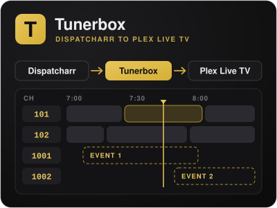</a>

### [Tunerbox](https://github.com/spongebobmoviept-lab/tunerbox)

**The missing piece between Dispatcharr and Plex Live TV.**

- A tuner Plex accepts, advertising exactly as many tuners as your provider allows connections.
- Sports and pay-per-view event channels that stay put when the provider renumbers them.
- A lineup that cleans itself, re-checked every night.

[Install guide](https://github.com/spongebobmoviept-lab/tunerbox#quick-start) &nbsp; [![Release][tunerbox-v]][tunerbox-rel] [![Docker: amd64, arm64][docker]][tunerbox-img] 

 
 

<a href="https://github.com/spongebobmoviept-lab/movienight-player">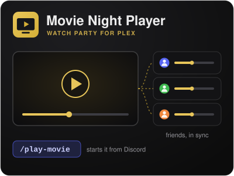</a>

### [Movie Night Player](https://github.com/spongebobmoviept-lab/movienight-player)

**A watch party for Plex, in everyone's browser.**

- Start a movie from Plex and your friends watch it together, in sync. They need no Plex account and no app.
- Run it from Discord through Servarr, or from the Playback tab on the watch page.
- Two editions: **Server Owner** (you run the Plex server) and **Guest** (a friend shares theirs with you).

[Install guide](https://github.com/spongebobmoviept-lab/movienight-player#readme) &nbsp; [![Release][player-v]][player-rel] [![Docker: amd64, arm64][docker]][player-img] 

 
 

<a href="https://github.com/spongebobmoviept-lab/Servarr">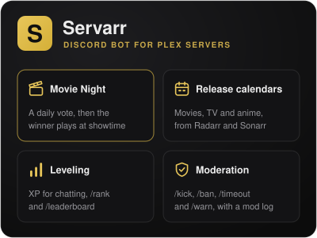</a>

### [Servarr](https://github.com/spongebobmoviept-lab/Servarr)

**The Discord bot for a Plex server's community.**

- **Movie Night:** a daily vote among movies you already have, then the winner starts in the Movie Night Player at showtime.
- Release calendars for movies, TV and anime.
- Leveling (`/rank`, `/leaderboard`) and moderation.

[Install guide](https://github.com/spongebobmoviept-lab/Servarr#quick-start) &nbsp; [![Release][servarr-v]][servarr-rel] [![Docker: amd64, arm64][docker]][servarr-img] 

 
 

<a href="https://github.com/spongebobmoviept-lab/Requestarr">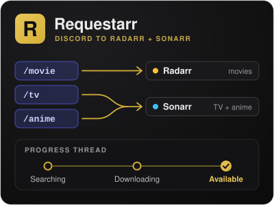</a>

### [Requestarr](https://github.com/spongebobmoviept-lab/Requestarr)

**Movie, TV and anime requests, right from Discord.**

- `/movie`, `/tv` and `/anime`: pick from up to five matches, confirm, done.
- Adds straight to Radarr or Sonarr. No Plex account linking, no dashboard to check.
- Posts progress in a thread until the request is ready to watch.

[Install guide](https://github.com/spongebobmoviept-lab/Requestarr#quick-start) &nbsp; [![Release][requestarr-v]][requestarr-rel] [![Docker: amd64, arm64][docker]][requestarr-img] 

 
 

<a href="https://github.com/spongebobmoviept-lab/Nyaarr">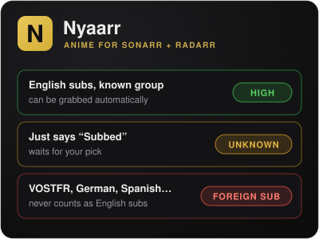</a>

### [Nyaarr](https://github.com/spongebobmoviept-lab/Nyaarr)

**Anime release filtering for Sonarr and Radarr.**

- Sub or dub by choice, for the whole library or per show.
- Tells English subs from foreign ones, and cleans up duplicate grabs.
- Never grabs what it isn't sure about: uncertain releases wait for your pick.

[Install guide](https://github.com/spongebobmoviept-lab/Nyaarr#quick-start) &nbsp; [![Release][nyaarr-v]][nyaarr-rel] [![Docker: amd64, arm64][docker]][nyaarr-img] 

 
 

<a href="https://github.com/spongebobmoviept-lab/Reclaimarr">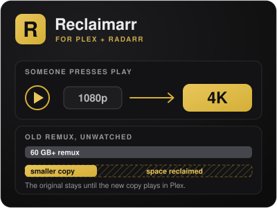</a>

### [Reclaimarr](https://github.com/spongebobmoviept-lab/Reclaimarr)

**4K when someone presses play. Smaller files everywhere else.**

- Starts a 4K upgrade the moment someone plays a movie that isn't in 4K yet.
- Swaps huge remuxes nobody has watched lately for a smaller copy of the same movie.
- Nothing is deleted until the replacement is confirmed playing in Plex.

[Install guide](https://github.com/spongebobmoviept-lab/Reclaimarr#quick-start) &nbsp; [![Release][reclaimarr-v]][reclaimarr-rel] [![Docker: amd64, arm64][docker]][reclaimarr-img] 

 

### How they fit around Plex

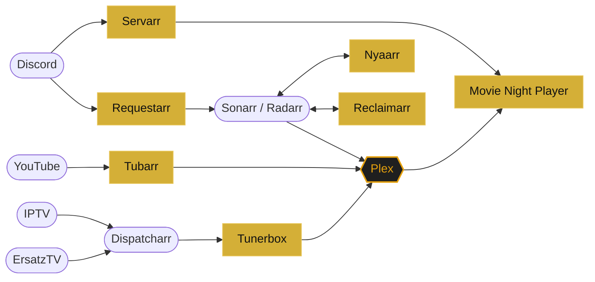

Gold boxes are the apps above; rounded ones are the software they plug into.

---

<a href="https://github.com/spongebobmoviept-lab/Discord-VLC-Audio-Share">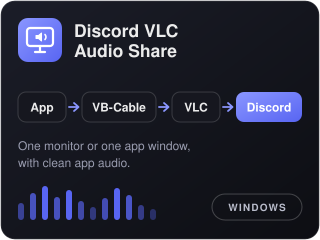</a>

### [Discord VLC Audio Share](https://github.com/spongebobmoviept-lab/Discord-VLC-Audio-Share)

**A small Windows tool for sharing to Discord with clean audio.**

- Shares one monitor or one app window, with that app's own sound.
- Routes the audio through VB-Audio Virtual Cable and VLC, so friends hear the app and nothing else.
- A Stream Deck button can start and stop it.

[Quick start](https://github.com/spongebobmoviept-lab/Discord-VLC-Audio-Share#quick-start) 

[docker]: https://img.shields.io/badge/docker-amd64%20%7C%20arm64-3d444d?logo=docker&logoColor=white
[tubarr-v]: https://img.shields.io/github/v/release/spongebobmoviept-lab/tubarr?label=release&color=dcb741
[tubarr-rel]: https://github.com/spongebobmoviept-lab/tubarr/releases/latest
[tubarr-img]: https://github.com/users/spongebobmoviept-lab/packages/container/package/tubarr
[tunerbox-v]: https://img.shields.io/github/v/release/spongebobmoviept-lab/tunerbox?label=release&color=dcb741
[tunerbox-rel]: https://github.com/spongebobmoviept-lab/tunerbox/releases/latest
[tunerbox-img]: https://github.com/users/spongebobmoviept-lab/packages/container/package/tunerbox
[player-v]: https://img.shields.io/github/v/release/spongebobmoviept-lab/movienight-player?label=release&color=dcb741
[player-rel]: https://github.com/spongebobmoviept-lab/movienight-player/releases/latest
[player-img]: https://github.com/users/spongebobmoviept-lab/packages/container/package/movienight-player
[servarr-v]: https://img.shields.io/github/v/release/spongebobmoviept-lab/Servarr?label=release&color=dcb741
[servarr-rel]: https://github.com/spongebobmoviept-lab/Servarr/releases/latest
[servarr-img]: https://github.com/users/spongebobmoviept-lab/packages/container/package/servarr
[requestarr-v]: https://img.shields.io/github/v/release/spongebobmoviept-lab/Requestarr?label=release&color=dcb741
[requestarr-rel]: https://github.com/spongebobmoviept-lab/Requestarr/releases/latest
[requestarr-img]: https://github.com/users/spongebobmoviept-lab/packages/container/package/requestarr
[nyaarr-v]: https://img.shields.io/github/v/release/spongebobmoviept-lab/Nyaarr?label=release&color=dcb741
[nyaarr-rel]: https://github.com/spongebobmoviept-lab/Nyaarr/releases/latest
[nyaarr-img]: https://github.com/users/spongebobmoviept-lab/packages/container/package/nyaarr
[reclaimarr-v]: https://img.shields.io/github/v/release/spongebobmoviept-lab/Reclaimarr?label=release&color=dcb741
[reclaimarr-rel]: https://github.com/spongebobmoviept-lab/Reclaimarr/releases/latest
[reclaimarr-img]: https://github.com/users/spongebobmoviept-lab/packages/container/package/reclaimarr
